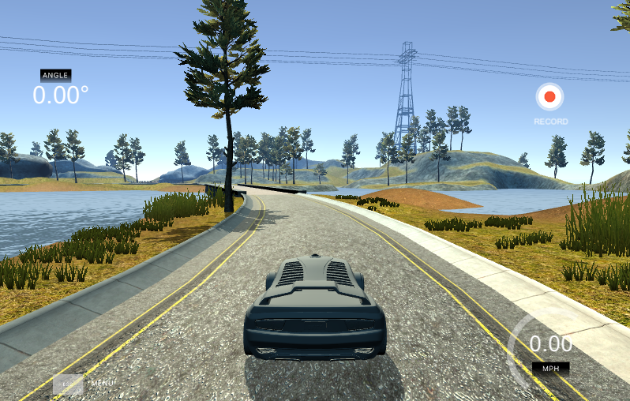
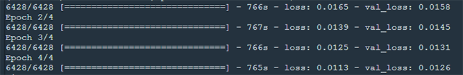
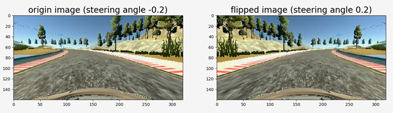

# CarND - Behavioral Cloning - Project 4
Udacity Self-Driving Car Engineer Nanodegree Program  
 

# Overview

In this project, you will use what you've learned about deep neural networks and convolutional neural networks to clone driving behavior. You will train, validate and test a model using Keras. The model will output a steering angle to an autonomous vehicle.

We have provided a simulator where you can steer a car around a track for data collection. You'll use image data and steering angles to train a neural network and then use this model to drive the car autonomously around the track.

The goals / steps of this project are the following:

- Use the simulator to collect data of good driving behavior
- Design, train and validate a model that predicts a steering angle from image data
- Use the model to drive the vehicle autonomously around the first track in the simulator. The vehicle should remain on the road for an entire loop around the track.
- Summarize the results with a written report

My code for this project is publicly available and can be found here:  https://github.com/ednaldogoncalves/CarND-BehavioralCloning-P4

## Steps

- Use the simulator to collect data (front camera frames and steering angles) of good driving behavior on track 1.
- Build a convolution neural network in Keras (tensorflow as backend) that predicts steering angles from images.
- Train and validate the model with a training and validation set on track 1.

## Files Submitted & Code Quality

### My project includes the following files

- **model.py** - containing the script to create and train the model
- **drive.py** - for driving the car in autonomous mode
- **model.h5** - containing a trained convolution neural network
- **writeup report** - summarizing the results
- **videos** - videos recording of your vehicle driving autonomously around the track for at least one full lap

### Pre-built simulator

- [Linux](https://is.gd/rD5n99)
- [Mac](https://is.gd/FXn3ew)
- [Windows](https://is.gd/Cy4C9N)

If you are interested here is the source code for the simulator repository

### Dependencies

This lab requires:

* [CarND Term1 Starter Kit](https://github.com/udacity/CarND-Term1-Starter-Kit)

The lab enviroment can be created with CarND Term1 Starter Kit. Click [here](https://github.com/udacity/CarND-Term1-Starter-Kit/blob/master/README.md) for the details.

The following resources can be found in this github repository:
* drive.py
* video.py
* writeup_template.md

The simulator can be downloaded from the classroom. In the classroom, we have also provided sample data that you can optionally use to help train your model.

- **PYTHON 64-bit** (Version 3.7.3)
- **OPENCV-PYTHON** Version 4.0.1.24)
- **SCIKIT-LEARN** (Version 0.20.3)
- **SCIPY** (Version 1.2.1)
- **KERAS** (Version 1.2.1)
- **TENSORFLOW** (Version 1.13.1)
- **MATPLOTLIB** (Version 3.0.3)
- **SETUPTOOLS** (Version 40.8.0)
- **PYTHON-SOCKETIO** (Version 4.0.0)
- **EVENTLET** (Version 0.4.15)
- **PILLOW** (Version 6.0.0)
- **FLASK** (Version 1.0.2)
- **PYTHON-DOTENV** (Version 0.10.1)
- **MOVIEPY** (Version 1.0.0)

My computer setting is as follows:

GeForce 740M, Intel Core i7-3537U@2.0GHz, 6G memory, Windows 7 Ultimate SP1 64-bit

### Submission includes functional code

Using the Udacity provided simulator and drive.py file, the car can be driven autonomously around the track by executing:

python drive.py model.h5 

### Submission code is usable and readable

The model.py file contains the code for training and saving the convolution neural network. The file shows the pipeline I used for training and validating the model, and it contains comments to explain how the code works.

## Model Architecture

### An appropriate model architecture has been employed

My model consists of a convolution neural network with 4 convolution layers which have 3x3 filter sizes and depths vary between 32 and 256, and 3 fully connected layers. The model includes RELU layers to introduce nonlinearity (model.py code line 80)
The model includes RELU layers to introduce nonlinearity, and the data is normalized in the model using a Keras lambda layer (model.py code line 78).
In Keras, lambda layers can be used to create arbitrary functions that operate on each image as it passes through the layer.
That lambda layer could take each pixel in an image and run it through the formulas:

pixel_normalized = pixel / 255
pixel_mean_centered = pixel_normalized - 0.5 

At this point the car is slightly left-right, but is not leaving the track

### Attempts to reduce overfitting in the model

The model was trained and validated on different data sets to ensure that the model was not overfitting (code line 104). The model was tested by running it through the simulator and ensuring that the vehicle could stay on the track.The model contains dropout layers in order to reduce overfitting (model.py code lines 81 and 84).

### Model parameter tuning

The model used an adam optimizer, so the learning rate was not tuned manually (model.py code line 112). The batch_size and nb_epoch are set (model.py cod line 41).

## Training Strategy

### Appropriate training data

First of all I divided data into 80% training data and 20% validation data.
Training data was chosen to keep the vehicle driving on the road. I used a combination of center lane driving, recovering from the left and right sides of the road by adding 0.2 and -0.2 to the steering angle of the that particular image respectively (model.py code lines 63 and 67).
For details about how I created the training data, see the next section.

### Creation of the Training Set & Training Process

The car seems to drive left and right, even in a straight line. To mitigate this problem would be to increase data collection and expand the training set, helping the model to generalize. You could change the brightness of the images or change them horizontally or vertically.
The solution I will take is to turn the images horizontally as a mirror, so I'm going to reverse the steering angles, balancing the data set, teaching the car to drive clockwise as well as counterclockwise only using camera data two benefits: 1 - Have more data to use in training; 2 - Train the network to be more comprehensive.

#### Camera setups

The simulator has three cameras: a center, right and left camera. One example is as follows: 

To capture good driving behavior, I recorded two laps on track 1 using center lane driving. In the training stage, I use all three cameras as training inputs. This is because we need to handle the issue of recovering from being off-center driving. How to achieve this:

- If we train the model to associate a given image from the center camera with a left turn, then we could also train the model to associate the corresponding image from the left camera with a somewhat softer left turn.
- And we could train the model to associate the corresponding image from the right camera with an even harder left turn.
- To estimate the steering angle of the left and right images, I use a correction value of 0.2 (in radians) see model.py cod line 63 and 67.

The image below gives a sense for how multiple cameras are used to train a self-driving car. This image shows a bird's-eye perspective of the car. The driver is moving forward but wants to turn towards a destination on the left.
From the perspective of the left camera, the steering angle would be less than the steering angle from the center camera. From the right camera's perspective, the steering angle would be larger than the angle from the center camera. The next section will discuss how this can be implemented in your project although there is no requirement to use the left and right camera images. 

The simulator captures images from three cameras mounted on the car: a center, right and left camera. That’s because of the issue of recovering from being off-center.In the simulator, you can weave all over the road and turn recording on and off to record recovery driving.I could train the model to associate the corresponding image from the right camera with an even harder left turn.I can simulate your vehicle being in different positions, somewhat further off the center line.For this project, I recording recoveries from the sides of the road back to center is effective. But it is also possible to use all three camera images to train the model. When recording, the simulator will simultaneously save an image for the left, center and right cameras.

#### Image Flipping

To augment the data set, I flipped center camera images thinking that this would provide more number of samples to be trained. For example, here is an image that has then been flipped (model.py code line 58 and 59). 

#### Brightness Changing:

In order to learn a more general model, I randomly changes the image’s brightness in HSV space (model.py function brightness_changein code line 30-37) 

#### Image Crop

In the image, the up part (sky) and bottom part (front part of the car) are not very useful for training, and on the other hand, it might lead to overfitting. So that I decided to crop out only the most useful part, and this is done in GPU for efficiency (model.py code line 79) 

I used this training data for training the model. The validation set helped determine if the model was over or under fitting. The ideal number of epochs was 4 as evidenced by the validation loss is not getting lower anymore. I used an adam optimizer so that manually training the learning rate wasn’t necessary.

To remove redundant details I cropped image's 50 rows pixels from the top of the image and 25 rows pixels from the bottom of the image (model.py code line 79) for all the images that is center camera images, left camera images and right camera images (right and left camera images are added by adding respective steering angle offset). The images after cropped are: 

Cropped Center Camera Image 

Cropped Left Camera Image 

Cropped Right Camera Image 

## Model Design Approach

My first attempt was to use a convolution neural network model similar to the LeNet, however it doesn’t performs well enough, high loss in both training and validation. 
So, I added tow dropout layers into the model and reduce the number of neurons in FC layers. Then I noticed that both the train loss and validation loss are small.
The overall strategy for deriving a model architecture was to drive a car through any terrain and any conditions.
In order to gauge how well the model was working, I split my image and steering angle data into a training and validation set. I found that model had a low mean squared error on the training set but a high mean squared error on the validation set. This implied that the model was overfitting.
To combat the overfitting, I have added dropout layer and maxpooling layer followed by convolution layer and I reduced number of epoches.
The final step was to run the simulator to see how well the car was driving around track one. There were a few spots where the vehicle fell off the track to improve the driving behavior in these cases, I have added left and right side images with offeseted driving angle, I have cropped the image to include only required details so that noise can be reduced, I flipped images so that additional details are available while training the vehicle.
I adopted the technique suggested in class to collect more data for the training. I simulated the car leaving the center of the track and going to the corner and then back to the middle track. I also driving with the car on counter-clockwise and adopted some general guidelines for data collection like: two or three laps of center lane driving; one lap of recovery driving from the sides; one lap focusing on driving smoothly around curves.
After several adjustments in the parameters, errors in libraries that I had to solve and 25 compilations, I finally arrived at a satisfactory result. At the end of the process, the vehicle is able to drive autonomously around the track without leaving the road.

### Evaluation Video – Track 1

From Front Camera					|			From Superior Camera (Simulator)
:---------------------------------: | : ----------------------------------------:
 | 

video_FrontCam.mp4	 

video_SuperiorCam.mp4

